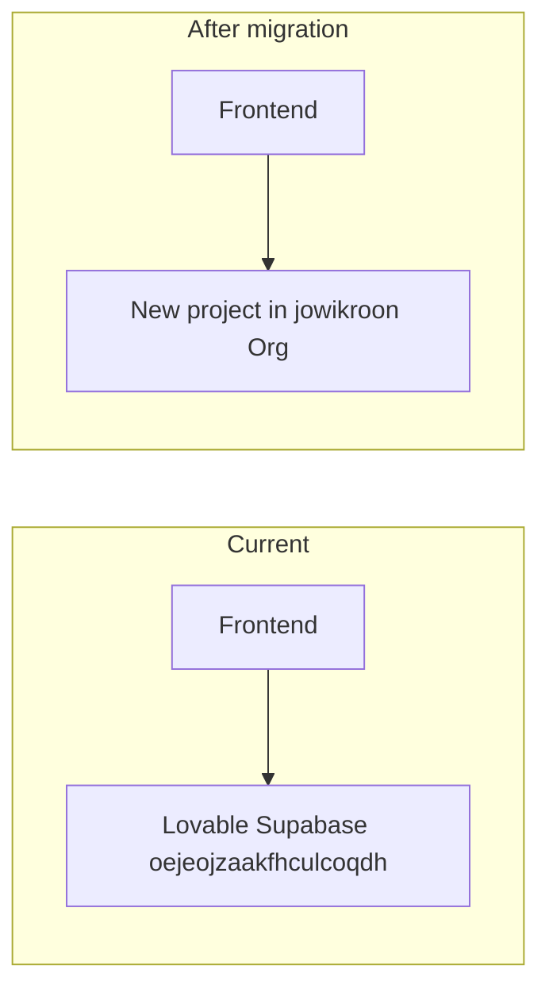

# Migrate from Lovable Supabase to your own organization

**Situation:** The app currently uses a Lovable-managed Supabase project (`oejeojzaakfhculcoqdh`) to which you have no dashboard/API access. You want to run everything under **jowikroon's Org** so you can deploy edge functions and manage secrets yourself.

**Try Path A first:** If you only need the backend (e.g. `trigger-webhook`) to match the repo, try [lovable-deploy-backend-first.md](lovable-deploy-backend-first.md) — deploy via the Lovable editor before migrating.

**Important:** You cannot "move" the Lovable project into your org. You create a **new** project in your org and point the app (and repo) at it. Data in the Lovable DB (users, content, workflow_runs, etc.) is not exportable without Lovable access; the new project starts empty.

---

## Overview



---

## Step 1: Create a new Supabase project in your org

1. Go to [Supabase Dashboard](https://supabase.com/dashboard).
2. Select **jowikroon's Org**.
3. **New project** — name it e.g. `hansvanleeuwen` or `hans-crafted-stories`.
4. Choose region (e.g. **eu-central-1** if you want EU).
5. Set database password and create the project.
6. When it’s ready, note:
   - **Project URL:** `https://<NEW_REF>.supabase.co`
   - **Project ref (ID):** from URL or Settings → General.
   - **Anon (public) key:** Settings → API → Project API keys → `anon` `public`.
   - **Service role key:** same page, `service_role` (keep secret).

Do **not** use "Claude n8n" or another existing project for this app unless you intend to share one backend; a dedicated project is simpler.

---

## Step 2: Apply database schema (migrations)

All schema is in the repo; you don’t need anything from Lovable.

1. In your repo:
   ```powershell
   cd "c:\Users\Malle Flappie\hans-crafted-stories"
   npx supabase login
   npx supabase link --project-ref <NEW_REF>
   ```
   Use the **new** project ref from Step 1. If asked for DB password, use the one you set when creating the project.

2. Push migrations:
   ```powershell
   npx supabase db push
   ```
   This applies all files under [supabase/migrations](supabase/migrations) (37 files) to the new project.

3. Optional: regenerate TypeScript types:
   ```powershell
   npm run supabase:types
   ```
   (If that script exists in package.json; otherwise skip or run `npx supabase gen types typescript --linked > src/integrations/supabase/types.ts`.)

---

## Step 3: Deploy edge functions

Deploy every function that has an `index.ts` under `supabase/functions/`. Supabase CLI deploys from the repo.

**Option A — run the script (recommended):**

From repo root, after `npx supabase link --project-ref <NEW_REF>`:

```powershell
.\scripts\deploy-supabase-functions.ps1
```

**Option B — deploy all in one go (if your CLI supports it):**

```powershell
npx supabase functions deploy
```

**Option C — deploy one by one:** run `npx supabase functions deploy <name>` for each of: trigger-webhook, hansai-chat, intent-router, portal-api, n8n-agent, empire-health, site-audit, keyword-research, monday-webhook, monday-trigger-agent, ai-content-suggest, llm-resume, n8n-create-workflow, n8n-filter-proxy, create-workflow-run, google-agent, google-oauth-start, google-oauth-callback, universal-router, connector-status.

---

## Step 4: Set edge function secrets (new project)

In the **new** project: **Project Settings → Edge Functions → Secrets** (or Dashboard → Edge Functions → Manage secrets).

Supabase automatically provides:

- `SUPABASE_URL`
- `SUPABASE_SERVICE_ROLE_KEY`

You must set the rest (same names the code uses):

| Secret | Used by | Where to get it |
|--------|--------|------------------|
| `LOVABLE_API_KEY` | hansai-chat, n8n-agent, intent-router, ai-content-suggest, keyword-research, google-agent | Lovable dashboard (if you still have it) or replace with your own LLM/API key and adjust code later |
| `N8N_BASE_URL` | n8n-create-workflow, n8n-filter-proxy | Your n8n instance (e.g. `https://hansvanleeuwen.app.n8n.cloud`) |
| `N8N_API_KEY` | n8n-create-workflow, n8n-filter-proxy | n8n API key from your n8n instance |
| `GEMINI_API_KEY` | hansai-chat, google-agent | Google AI Studio |
| `OPENAI_API_KEY` | llm-resume | OpenAI |
| `GOOGLE_OAUTH_CLIENT_ID` | google-oauth-start, google-oauth-callback, google-agent | Google Cloud Console |
| `GOOGLE_OAUTH_CLIENT_SECRET` | same | Google Cloud Console |
| `GOOGLE_OAUTH_STATE_SECRET` | same (optional) | Any random string |
| `APP_ORIGIN` | google-oauth-* | `https://hansvanleeuwen.com` |
| `MONDAY_API_TOKEN` | monday-webhook, monday-trigger-agent, portal-api (if used) | Monday.com API token |
| `FIRECRAWL_API_KEY` | site-audit | Firecrawl (optional if you don’t use site audit) |
| `COMMANDER_WEBHOOK_TOKEN` | trigger-webhook (optional) | Generate a random token if you want webhook auth |

If you don’t have `LOVABLE_API_KEY`, some features (intent routing, AI chat) may need to be switched to another provider (e.g. OpenAI/Gemini only); that’s a follow-up code change.

---

## Step 5: Configure Auth in the new project

In the **new** project:

1. **Authentication → URL Configuration**
   - Site URL: `https://hansvanleeuwen.com`
   - Redirect URLs: add:
     - `https://hansvanleeuwen.com/auth/callback`
     - `https://hansvanleeuwen.com/**`
     - `http://localhost:5173/auth/callback`
     - `http://localhost:8080/auth/callback`

2. **Authentication → Providers**
   - Enable Email (and any others you use).
   - For Google: enable and set Client ID / Client Secret from Google Cloud Console. In Google Cloud, set authorized redirect URI to:
     `https://<NEW_REF>.supabase.co/auth/v1/callback`

---

## Step 6: Point the app at the new project

### 6.1 Repo and local env

- **[supabase/config.toml](supabase/config.toml):** set `project_id = "<NEW_REF>"`.
- **.env.development** and **.env.production** (local only, do not commit secrets):
  - `VITE_SUPABASE_URL` = `https://<NEW_REF>.supabase.co`
  - `VITE_SUPABASE_PUBLISHABLE_KEY` = new project’s **anon** key
  - `VITE_SUPABASE_PROJECT_ID` = `<NEW_REF>`
- **.env.example:** keep placeholders; optionally add a comment that production uses the new project ref.

### 6.2 Cloudflare Pages (production)

- **Workers & Pages** → your project → **Settings** → **Environment variables**
- For **Production** (and Preview if used) set:
  - `VITE_SUPABASE_URL` = `https://<NEW_REF>.supabase.co`
  - `VITE_SUPABASE_PUBLISHABLE_KEY` = new project’s **anon** key
- **Redeploy** the site (env vars are applied at build time).

### 6.3 Docs that reference the old ref

Search for `oejeojzaakfhculcoqdh` and replace with `<NEW_REF>` (or a note “use your project ref”) in:

- [docs/n8n-credentials-setup.md](docs/n8n-credentials-setup.md)
- [docs/empire-n8n-flow.md](docs/empire-n8n-flow.md)
- [docs/inventory-secrets-and-workflows.md](docs/inventory-secrets-and-workflows.md)
- [config/README.md](config/README.md)
- [config/all-credentials.export.env.example](config/all-credentials.export.env.example)
- [public/empire/CLAUDE.md](public/empire/CLAUDE.md)
- [docs/gemini-google-control.md](docs/gemini-google-control.md)
- [docs/lovable-cloudflare-pages.md](docs/lovable-cloudflare-pages.md)

(Code uses env vars, so no code changes are required for the URL/keys; only config and docs.)

---

## Step 7: Data and users

- **Lovable DB:** You cannot export data without Lovable’s cooperation. Any existing users, content, and workflow_runs stay on the old project.
- **New project:** Starts empty. Users must sign up again; you may need to re-create admin users (e.g. via migration [supabase/migrations/20260301120000_ensure_admin_hansvl3.sql](supabase/migrations/20260301120000_ensure_admin_hansvl3.sql) or manually in Dashboard).
- If you had important content (blog posts, pages, etc.) in the old DB, the only path is to get a dump from Lovable or re-enter data in the new project.

---

## Checklist (quick reference)

- [ ] Create new Supabase project in jowikroon's Org; note URL, ref, anon key, service role key.
- [ ] `npx supabase link --project-ref <NEW_REF>` and `npx supabase db push`.
- [ ] Deploy all edge functions (`npx supabase functions deploy` or one by one).
- [ ] Set Edge Function secrets in the new project (see table above).
- [ ] Configure Auth (redirect URLs, Google OAuth if used).
- [ ] Update `supabase/config.toml` and local `.env.*` with new ref and anon key.
- [ ] Set `VITE_SUPABASE_URL` and `VITE_SUPABASE_PUBLISHABLE_KEY` in Cloudflare Pages and redeploy.
- [ ] Update docs that hardcode `oejeojzaakfhculcoqdh`.
- [ ] Test: login, `/run health-check`, and main flows on hansvanleeuwen.com.

---

## If something breaks

- **"Failed to fetch"** → Frontend still using old URL or env not set in Cloudflare; confirm env vars and redeploy.
- **401 from edge functions** → JWT or anon key mismatch; confirm new anon key in frontend env.
- **Intent / AI chat failing** → Likely missing or wrong `LOVABLE_API_KEY` (or replacement) in Edge Function secrets.
- **n8n workflows not triggering** → Check `N8N_BASE_URL` and `N8N_API_KEY` in secrets and that trigger-webhook is deployed.
