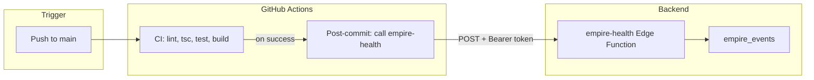

# Post-commit workers and agents — review and solution

## What runs today after each commit

| Trigger | Workflow | What it does |
|--------|----------|---------------|
| Push / PR to `main` | **CI** (`.github/workflows/ci.yml`) | Lint, `tsc`, tests, build. Concurrency cancels in-progress runs. |
| Push / PR to `main` | **CodeQL** (`.github/workflows/codeql.yml`) | Static analysis (JS/TS), security findings in Security tab. |
| Push to `main` | Cloudflare Pages | Auto-deploys from GitHub (outside this repo). |

The **Empire** health check (`empire-health` Edge Function) runs only when you open the Empire dashboard or click Refresh. It is not triggered automatically after a commit.

---

## Recommended solution: CI → empire-health after each commit

Use **GitHub Actions** as the trigger and the existing **Supabase Edge Function** as the “agent.” No Cloudflare Worker is required unless you want the logic to live in Cloudflare.

### Flow

1. **On every push to `main`**, CI runs (lint, typecheck, test, build).
2. **If CI succeeds**, a second job calls the **empire-health** Edge Function.
3. **empire-health** checks all 7 layers (Shield, Portal, Brain, Memory, etc.), writes a row to **empire_events**, and returns the result.
4. The Empire dashboard **Audit trail** shows that run, so you get an automatic post-commit health snapshot without opening the page.

### Why this instead of a Worker

- **Supabase Edge Function** is already your “Immune” layer and owns `empire-health`. Reusing it keeps one place for health logic and avoids duplicating checks in a Worker.
- **Cloudflare Worker** is useful if you want post-commit logic to live entirely in Cloudflare (e.g. cache purge, Worker-only APIs). For “run the same health check and log to Supabase,” the Edge Function is enough.
- Optional later: a **Worker** that receives a GitHub webhook and then calls empire-health (or a dedicated “commit webhook” function) if you want to move trigger logic to Cloudflare.

### What was implemented

- **CI workflow** (`.github/workflows/ci.yml`): a job **post-commit-check** runs after **build** (only on **push** to **main**, not on PRs) and `POST`s to `empire-health` with a bearer token.
- **Required secrets:** In the repo **Settings → Secrets and variables → Actions**, add:
  - **`SUPABASE_URL`** — your Supabase project URL (e.g. `https://xxxx.supabase.co`).
  - **`SUPABASE_SERVICE_ROLE_KEY`** — used as `Authorization: Bearer …` for the Edge Function. Prefer a dedicated token with minimal scope if you don’t want to use the full service role key in CI.

If these secrets are not set, the **post-commit-check** job will fail when it runs (push to main). Add the secrets to fix it.

After each successful commit on `main`, the Empire audit trail will get a new “Health check: X/7 services online” event from source **empire-health**, so you can see that the automatic check ran.

---

## Optional: Cloudflare Worker for post-commit

If you later want the trigger to be a **Cloudflare Worker** (e.g. to add caching, or to run only in Cloudflare):

1. **GitHub webhook** → Cloudflare Worker URL (with a shared secret in the webhook payload or header).
2. Worker verifies the event is a `push` to `main`, then `fetch()`es your **empire-health** Edge Function (with a bearer token stored in Worker env).
3. Worker can also call Cloudflare APIs (e.g. purge cache, update DNS) before or after calling empire-health.

That keeps “what to check” in Supabase and “when to run and what to do in CF” in the Worker. The current solution avoids this complexity by letting GitHub Actions call empire-health directly.

---

## Summary

| Question | Answer |
|----------|--------|
| What checks run automatically after each commit? | CI (lint, tsc, test, build) and CodeQL. **Now also:** empire-health via a CI job. |
| Where is the “agent”? | **empire-health** Supabase Edge Function (7-layer check + log to empire_events). |
| Do I need a Worker? | No. Optional later if you want the trigger or extra Cloudflare logic in a Worker. |
| What do I need to configure? | GitHub Actions secrets: `SUPABASE_URL` and `SUPABASE_SERVICE_ROLE_KEY` (or a dedicated token). |
